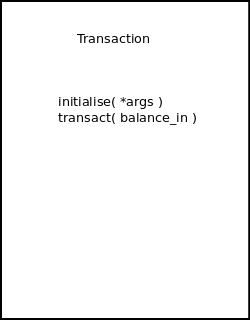

# bank_tech_test

## Specification (from Makers Academy)
### Requirements

You should be able to interact with your code via a REPL like IRB or Node. (You don't need to implement a command line interface that takes input from STDIN.)

Deposits, withdrawal.
    
Account statement (date, amount, balance) printing.

Data can be kept in memory (it doesn't need to be stored to a database or anything).

### Acceptance criteria

Given a client makes a deposit of 1000 on 10-01-2023

And a deposit of 2000 on 13-01-2023

And a withdrawal of 500 on 14-01-2023

When she prints her bank statement

Then she would see

date || credit || debit || balance

14/01/2023 || || 500.00 || 2500.00

13/01/2023 || 2000.00 || || 3000.00

10/01/2023 || 1000.00 || || 1000.00

## Design ideas 1
    Account
        Linked to a Bank (branch)
        Has a unique number
        Associated with a Customer
        Includes list of transactions
    Customer
        Details of person for whom account is opened
    Transaction
        Deposit or withdrawal and amount
        Associated with a function to amend balance with?
    Statement
        Formatted printing of transactions for a given account
    Bank
        Contains a number of accounts
        Has a unique sort-code
        Starts off with no accounts

### Design diagram 1

## Design ideas 2
The above diagram does not yet include transactions. It is possible that there may be an appropriate design pattern to use and this will be part of deliberation before possibly adding that to the design.

## Design ideas 3
Transactions may benefit from the use of the Command design pattern, to enable transactions besides simple deposits and withdrawals (e.g. tax deduction, interest adding, balance transfers etc.) so may be preferable to return to that class later.

Also Statement may benefit from the use of either Template or Strategy design pattern, to allow different formats of statement, which is a very likely requirement to want to add. For now may be preferable to return to that class later.

Customer as above may be simplified to adhere to the SRP (Single Responsibility Principle) as currently any change in how names or addresses are represented would result in Customer needing to be changed. Address and Name would be better as independent classes.

## TDD implementation 1
### Name class
Allow a required first, optional middle (maybe more than one) and optional last name. 

Validate the inputs according to reasonable English language expectations. 

First name should consist of a sequence of alphabet characters with the first a capital letter. There should be no spaces in the name and any spaces at start and end should be removed. The name may include one or more '-' characters but not more than one next to each other, and not at the start or end of the name.

Middle names should optionally consist of one or more names separated by spaces, with each name similar to a First name, i.e. start with capital letter and allow dash or dashes as above.

Last name is optional but if present follows same validation rule as First name.

## TDD implementation 2
### Address class
Set basic validation on the first three fields but more precise validation for postcode.

## Design ideas 4
The NINumber field in the Customer class was chosen to give each Customer a unique identifier. However to make this easier to change, a Strategy pattern seems appropriate to use.

## TDD implementation 3
### Customer class
Start gradually creating Customer class and classes it will be composed of, unit-testing these first.

### CustomerIdStrategy and CustomerIdNIStrategy classes
To implement the abstract and concrete classes for the Strategy design pattern, making future changes easy if required. Added basic validation for UK NI numbers.

## Design ideas 5
The Account class will be composed of a Customer and a sequence of Transactions. It will be created by a Bank, which will provide the Account with a unique number. It will be opened when it is first created and will retain records of its transactions even after it is closed, for reference purposes. Modelling a Transaction using the Command design pattern as mentioned above could have the additional benefit of potentially being able to undo a transaction if that is needed in the future. To support potential use of undo in future, and the state recording this would require, classes will be used for the Command pattern rather than procs, which Ruby provides.

### Design diagram 2

## TDD implementation 4
### Account class
Start gradually creating Account class and classes it will be composed of, unit-testing these first.

### TransactionCommand, TransactionDepositCommand and TransactionWithdrawalCommand classes
To implement the abstract and concrete classes for the Command design pattern, making future changes easy if required.

