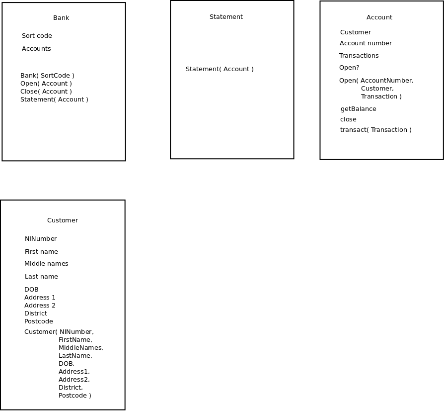

# bank_tech_test

## Specification (from Makers Academy)
### Requirements

You should be able to interact with your code via a REPL like IRB or Node. (You don't need to implement a command line interface that takes input from STDIN.)

Deposits, withdrawal.
    
Account statement (date, amount, balance) printing.

Data can be kept in memory (it doesn't need to be stored to a database or anything).

### Acceptance criteria

Given a client makes a deposit of 1000 on 10-01-2023

And a deposit of 2000 on 13-01-2023

And a withdrawal of 500 on 14-01-2023

When she prints her bank statement

Then she would see

date || credit || debit || balance

14/01/2023 || || 500.00 || 2500.00

13/01/2023 || 2000.00 || || 3000.00

10/01/2023 || 1000.00 || || 1000.00

## Design ideas 1
    Account
        Linked to a Bank (branch)
        Has a unique number
        Associated with a Customer
        Includes list of transactions
    Customer
        Details of person for whom account is opened
    Transaction
        Deposit or withdrawal and amount
        Associated with a function to amend balance with?
    Statement
        Formatted printing of transactions for a given account
    Bank
        Contains a number of accounts
        Has a unique sort-code
        Starts off with no accounts

### Design diagram 1

## Design ideas 2
The above diagram does not yet include transactions. It is possible that there may be an appropriate design pattern to use and this will be part of deliberation before possibly adding that to the design.

